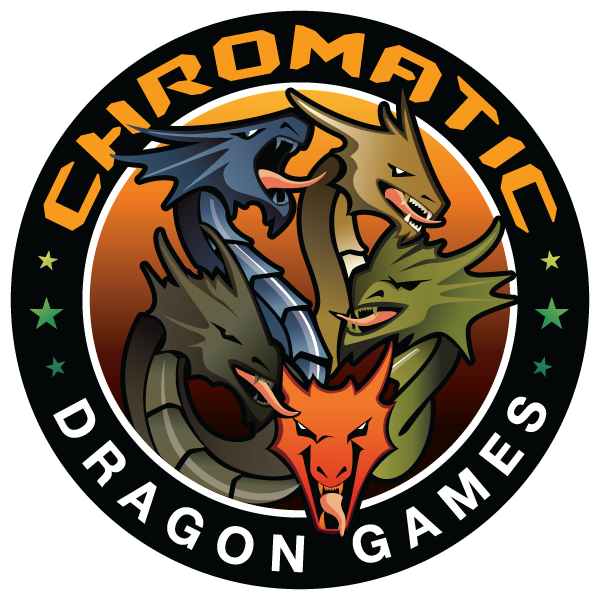

# Chromatic Games Landing Site

## Description

A site created for the use of Chromatic Dragon Games to help spread the word of the magical place that is thier store!

## Deployed App

[Chromatic Dragon Games App](https://chromatic-dragon.herokuapp.com/)

## Table of Contents

- [Screenshots](#Screenshots)
- [Technologies](#Technologies)
- [Feedback](#Feedback)
- [Future Development](#Future_Development)

## Screenshots

## Technologies

- React
- node.js
- express
- AtlasDB
- MongoDb
- Mongoose
- nodemon
- Heroku

## Feedback

Contact us with any feedback or questions through GitHub or by email.

- [Dustin](https://github.com/DustinErwin)
- [Ethan](https://github.com/Ewager1)
- [Jesal](https://github.com/JesalDM)
- [Sarah](https://github.com/smanter82/)

## Future_Development

- Track sales data
- Contact form

[(Back to Top)](#Description)
